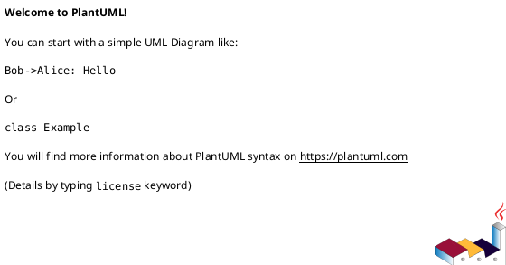
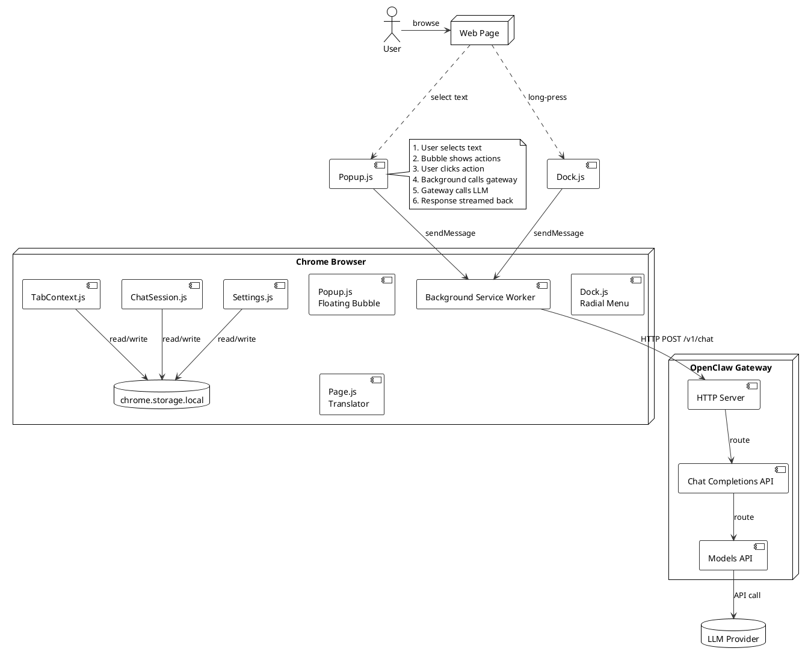

## Chrome Extension Runtime Environments

### 环境对比

| 环境 | 上下文 | 生命周期 | 能访问页面 DOM |
|------|--------|----------|----------------|
| Content Script | 注入到网页，和页面共享 JS 上下文 | 随页面存在 | ✅ |
| Side Panel | 独立面板上下文，类似 iframe | 随用户打开存在 | ❌ |
| Background (Service Worker) | 插件后台，独立浏览器实例 | 插件运行期间（可休眠） | ❌ |
| Popup | 点击图标弹出的临时 UI | 点击期间存在，关闭即销毁 | ❌ |

### 通信全图

```
┌─────────────────────────────────────────────────────────┐
│ 插件扩展上下文                                           │
│                                                          │
│  ┌──────────┐  ┌────────────────┐  │                    │
│  │  Popup   │◄──────►│   Background    │◄─── chrome.runtime.sendMessage
│  │          │ ① │ (Service Worker)│  │                    │
│  └──────────┘  └───────┬────────┘ ② │                    │
│  ┌────────────┐         │          │                    │
│  │ Side Panel │◄───────────────┤          │                    │
│  └────────────┘         │          │                    │
│                         │          │                    │
│  ┌──────────────────────┴───────┐ │                    │
│  │ chrome.runtime.sendMessage ③   │ │                    │
│  │ chrome.runtime.onMessage        │ │                    │
│  └──────────────────────────────────────┘ │                    │
└─────────────────────────────────────────────────────────┘
                          │
                          │ chrome.tabs.sendMessage ④
                          ▼
         ┌───────────────────────┐
         │   Content Script      │◄── inject 到网页
         │   (页面上下文 / DOM)  │
         └───────────────────────┘
```

### API 选择指南

#### 发消息：sendMessage vs tabs.sendMessage

| 场景 | 用哪个 | 说明 |
|------|--------|------|
| Background → Content Script | `chrome.tabs.sendMessage(tabId, msg)` | 发送到指定标签页的 content script |
| Popup → Content Script | `chrome.tabs.sendMessage(tabId, msg)` | 经由 background 中转，或直接 tabs |
| Side Panel → Content Script | `chrome.tabs.sendMessage(tabId, msg)` | 同上 |
| Content Script → Background | `chrome.runtime.sendMessage(msg)` | content script 用 runtime |
| Popup → Background | `chrome.runtime.sendMessage(msg)` | popup 和 background 直连 |
| Side Panel → Background | `chrome.runtime.sendMessage(msg)` | side panel 和 background 直连 |

**规律：只要目标是 Content Script，就用 `tabs.sendMessage(tabId, ...)`**

#### 收消息：onMessage vs tabs.onMessage

| 监听位置 | 用哪个 | 说明 |
|----------|--------|------|
| Background | `chrome.runtime.onMessage.addListener` | 接收 popup、side panel、content script 的消息 |
| Background | `chrome.tabs.onMessage.addListener` | 专门接收来自 content script 的消息 |
| Content Script | `chrome.runtime.onMessage.addListener` | 接收来自 background 的响应 |
| Popup | `chrome.runtime.onMessage.addListener` | 接收 background 的响应 |
| Side Panel | `chrome.runtime.onMessage.addListener` | 接收 background 的响应 |

**规律：在 background 里，两个都能用，通常用 `runtime.onMessage` 统一处理所有扩展内部消息；如果需要区分消息来源 `tab`（区分不同标签页的 content script），用 `tabs.onMessage`**

### 实际例子（ClawSide 场景）

**Content Script 发现不兼容，上报给 Background**

```javascript
// content script → background（用 runtime）
chrome.runtime.sendMessage({
  type: 'INCOMPATIBILITY_REPORT',
  url: window.location.href,
  detail: 'Ollama v0.12.4 不支持 macOS 12'
});

// background 接收（统一用 runtime）
chrome.runtime.onMessage.addListener((msg, sender, sendResponse) => {
  if (msg.type === 'INCOMPATIBILITY_REPORT') {
    // 处理并存储
    chrome.storage.local.set({ lastReport: msg });
    sendResponse({ ok: true });
  }
});
```

**Background 通知 Side Panel 显示内容**

```javascript
// background → side panel（用 runtime）
chrome.runtime.sendMessage({
  type: 'SHOW_TRANSLATION',
  content: translatedText
}, (response) => {
  // side panel 已接收后的回调
});

// side panel 接收
chrome.runtime.onMessage.addListener((msg, sender, sendResponse) => {
  if (msg.type === 'SHOW_TRANSLATION') {
    renderTranslation(msg.content);
  }
});
```

**Background 向 Content Script 发指令（比如清空页面翻译）**

```javascript
// background → content script（必须用 tabs + tabId）
chrome.tabs.query({ active: true, currentWindow: true }, (tabs) => {
  chrome.tabs.sendMessage(tabs[0].id, {
    type: 'CLEAR_TRANSLATIONS'
  });
});

// content script 接收
chrome.runtime.onMessage.addListener((msg, sender) => {
  if (msg.type === 'CLEAR_TRANSLATIONS') {
    // 清除页面上的翻译占位符
  }
});
```

### 一句话总结

- `chrome.tabs.sendMessage` = 向页面里的 content script 发消息（需要 tabId）
- `chrome.runtime.sendMessage` = 扩展内部通信（popup ↔ background ↔ side panel 之间）

接收端：`chrome.runtime.onMessage` 通用，`chrome.tabs.onMessage` 专用于 content script 来消息的场景（background 里用它可额外拿到 `sender.tab` 信息）

---

## Architecture v2.0.0



## Architecture v1.0.0


